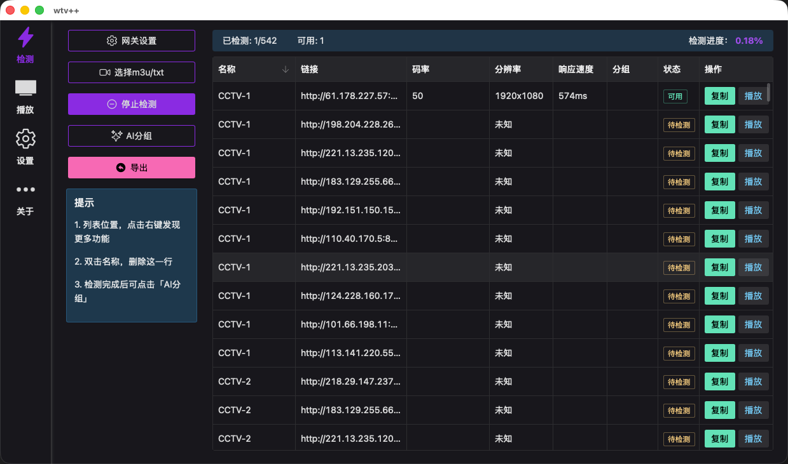
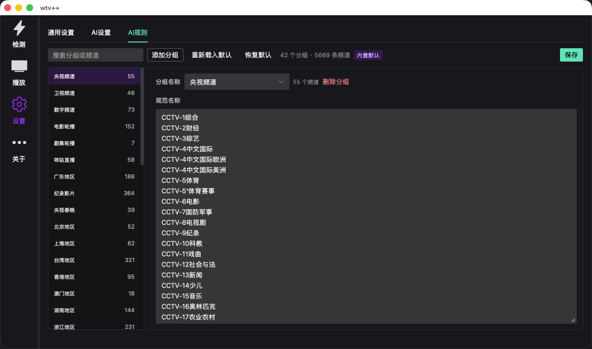

# wtv++

一个面向直播源整理与播放的桌面工具：导入列表、批量检测可用性、AI 智能分组，并直接在线观看。

## 功能概览

- **检测**：导入 m3u / txt 直播源，批量检测是否可用，查看码率、分辨率、响应速度等信息
- **播放**：按分组浏览可用频道，一键在线播放
- **AI 分组**：根据规则自动整理频道名称与分组，也可自定义分组规则
- **导出**：按状态、分辨率等条件导出整理后的列表

## 界面预览

### 检测

导入直播源后批量检测可用性，支持 AI 分组与导出。

### 播放

按分组选择频道，直接在线观看。

### 设置

配置通用选项、AI 接口，以及自定义 AI 分组规则。

## 简单上手

1. 打开「检测」，选择本地的 m3u / txt 文件导入
2. 点击「开始检测」，等待结果（可随时停止）
3. 检测完成后可使用「AI 分组」整理频道
4. 在「播放」中观看可用频道，或在「检测」页导出列表
5. 需要自定义分组规则时，前往「设置」进行调整

## 关于

项目地址：[https://github.com/aiqoder/wtvplusplus](https://github.com/aiqoder/wtvplusplus)
